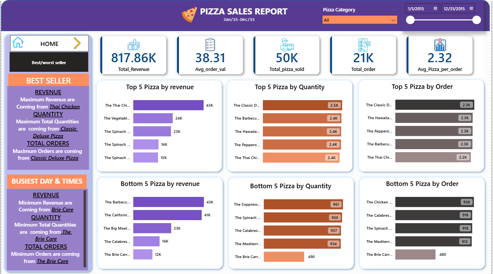

# 📊 Pizza Sales Analysis Dashboard (Power BI)

## 📸 Dashboard Screenshots

## 📌 Project Overview
- This interactive Power BI dashboard analyzes pizza sales performance across multiple dimensions such as revenue, orders, quantity sold, pizza category, and pizza size.
- The dashboard is designed with **two navigable pages**: a **Home page** for overall business insights and a **Best/Worst Seller page** for detailed product-level performance analysis.
- It provides actionable insights to identify peak sales periods, customer preferences, and top-performing as well as underperforming pizzas.

## 📄 Dashboard Pages
- **Home Page**: Displays key KPIs including total revenue, average order value, total orders, pizzas sold, and average pizzas per order, along with daily and monthly sales trends.
- **Best/Worst Seller Page**: Highlights top and bottom 5 pizzas based on revenue, quantity sold, and number of orders to support product optimization decisions.

## 🧰 Tools & Technologies
- Power BI  
- SQL  
- DAX (Data Analysis Expressions)  
- Microsoft Excel / CSV  
- Data Cleaning & Data Modeling  

## 📂 Dataset
- Source: Sample Pizza Sales Dataset  
- Format: CSV  
- Time Period: Jan 2015 – Dec 2015  
- Records: 50,000+  

## 📈 Dashboard Features
- KPI cards for revenue, orders, and sales metrics  
- Daily and monthly trend analysis  
- Sales distribution by pizza category and size  
- Top & bottom product performance analysis  
- Page navigation for seamless user experience  
- Interactive filters for pizza category and date range  

## ▶️ How to Use
1. Download the `.pbix` file from the repository  
2. Open it using **Power BI Desktop**  
3. Use slicers and navigation buttons to explore insights  

## 🚀 Future Enhancements
- Add sales forecasting using time-series analysis  
- Include profit and cost analysis  
- Implement advanced DAX measures for deeper insights  
- Automate data refresh with real-time data sources  

## 👤 Author
**Ajay Chitroda**  
Data Analyst | Aspiring Data Scientist  
